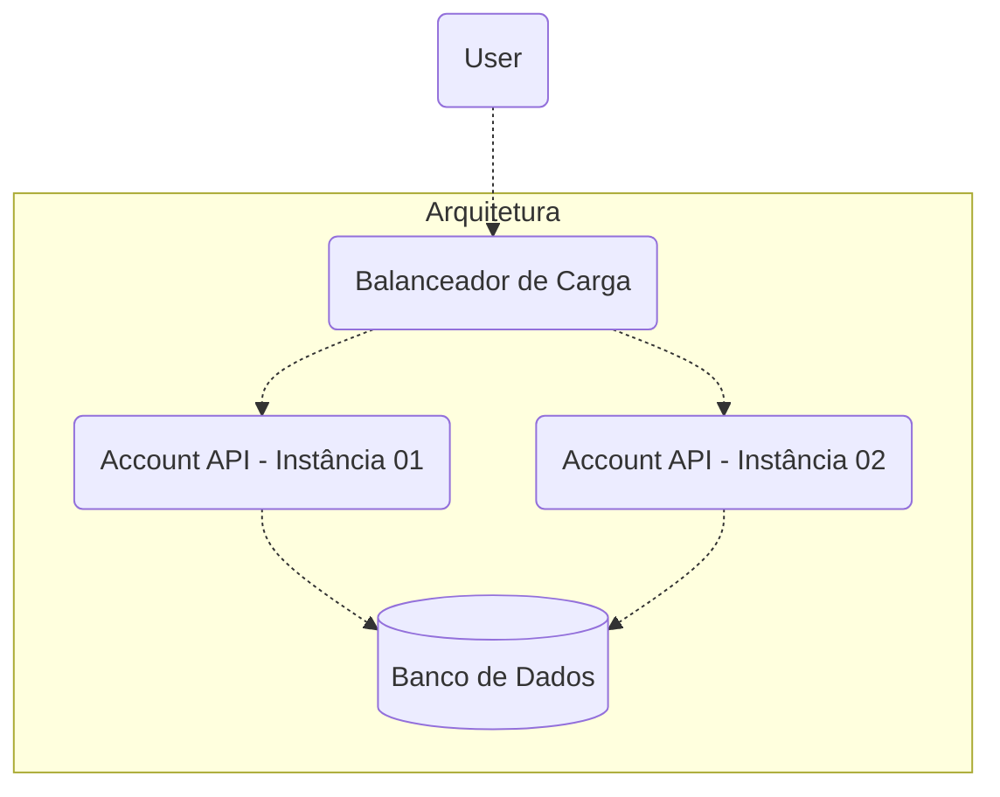

# Account API

Este documento está originalmente em [Inglês](https://github.com/lucsalm/account-api/blob/main/README.md), porém também está traduzido em [Português](https://github.com/lucsalm/account-api/blob/main/README-pt-BR.md).

## Visão geral:

Este projeto é minha implementação do desafio [Backend Rumble](https://github.com/zanfranceschi/rinha-de-backend-2024-q1). Em essência, o desafio consiste na criação de uma API capaz de realizar operações transacionais de crédito e débito na conta de um cliente, além de permitir a consulta de extrato. O tema central do desafio é o controle de concorrência, por esse motivo, a implementação explora conceitos [ACID](https://www.ibm.com/docs/pt-br/cics-tx/11.1?topic=processing-acid-properties-transactions), fazendo uso de ferramentas de controle do Spring Boot como [Transactional](https://docs.spring.io/spring-framework/docs/current/reference/html/data-access.html#transaction) e [Lock](https://docs.spring.io/spring-data/jpa/docs/current/reference/html/#locking).

## Stack


## Arquitetura




## Dados Iniciais

### Clientes

| id | limite | saldo inicial
| - | - | -
| 1 | 100000 | 0
| 2 | 80000 | 0
| 3 | 1000000 | 0
| 4 | 10000000 | 0
| 5 | 500000 | 0

## Como Usar

1. Certifique-se de que o Docker esteja instalado em sua máquina.
2. Clone este repositório para o seu ambiente local.
3. Navegue até o diretório do projeto.
4. No terminal, execute o seguinte comando para construir e iniciar o contêiner Docker:
   - No Linux, execute:
       ```bash
       docker compose up
       ```

   - No Windows, execute:
       ```bash
       docker-compose up
       ```

5. Após a construção dos contêineres e a inicialização da aplicação, acesse `http://localhost:9999/swagger-ui/index.html` para visualizar sua documentação. Você deverá ver a seguinte tela:


**Observações:**
- Certifique-se de que as portas `9999`, `8081`, `8082` e `5432` não estão sendo utilizadas por outra aplicação em seu sistema para evitar conflitos. Se necessário, você pode modificar o mapeamento de porta no arquivo `docker-compose.yml`.
- O hostname exibido na documentação `api01` ou `api02` refere-se aos hostnames dos containers, portanto, ao fazer requisições para a API deve-se considerar o hostname `localhost` e a porta `9999`.
