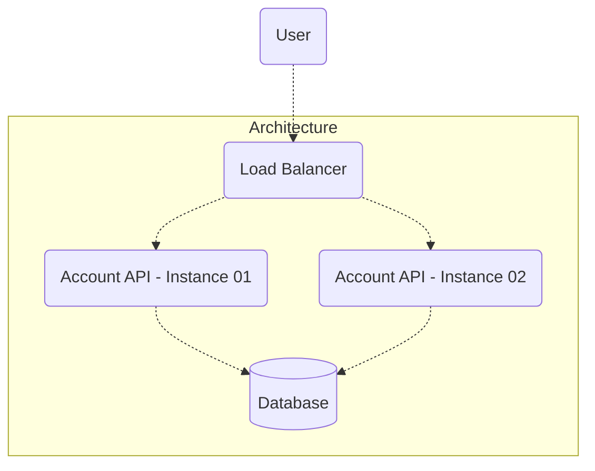

# Account API

This document is available in [English](https://github.com/lucsalm/account-api/blob/main/README.md), but it's also available in [Portuguese](https://github.com/lucsalm/account-api/blob/main/README-pt-BR.md).

## Overview

This project is my implementation of the [Rinha de Backend](https://github.com/zanfranceschi/rinha-de-backend-2024-q1) challenge. In essence, the challenge consists of creating an API capable of performing credit and debit transactional operations on a customer's account, as well as enabling statement inquiry. The central theme of the challenge is concurrency control, for this reason, the implementation explores [ACID](https://www.ibm.com/docs/en/cics-tx/11.1?topic=processing-acid-properties-transactions) concepts, making use of Spring Boot control tools such as [Transactional](https://docs.spring.io/spring-framework/docs/current/reference/html/data-access.html#transaction) and [Lock](https://docs.spring.io/spring-data/jpa/docs/current/reference/html/#locking).

## Stack


## Architecture



## Initial Data

### Customers

| id | limit    | initial balance |
|----|----------|-----------------|
| 1  | 100000   | 0               |
| 2  | 80000    | 0               |
| 3  | 1000000  | 0               |
| 4  | 10000000 | 0               |
| 5  | 500000   | 0               |

## How to Use

1. Make sure Docker is installed on your machine.
2. Clone this repository to your local environment.
3. Navigate to the project directory.
4. In the terminal, execute the following command to build and start the Docker container:
    - On Linux, run:
        ```bash
        docker compose up
        ```

    - On Windows, run:
        ```bash
        docker-compose up
        ```

5. After the containers are built and the application is started, access [Swagger](http://localhost:9999/swagger-ui/index.html) to view its documentation. You should see the following screen:


**Notes:**
- Ensure that ports `9999`, `8081`, `8082`, and `5432` are not being used by another application on your system to avoid conflicts. If necessary, you can modify the port mapping in the `docker-compose.yml` file.
- The hostname displayed in the documentation `api01` or `api02` refers to the container hostnames, therefore, when making requests to the API, the hostname `localhost` and port `9999` should be considered.
